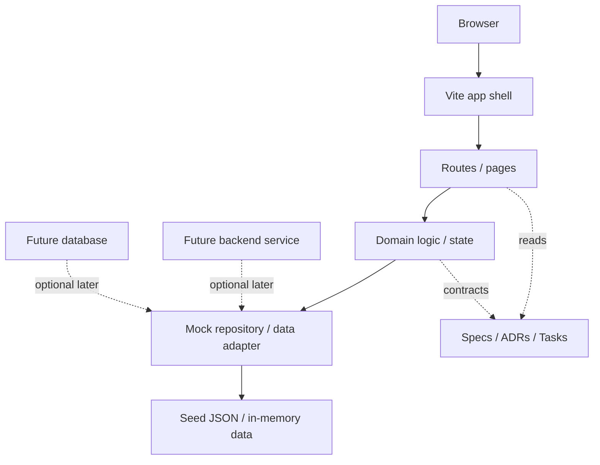

# ADR-0001: Architecture Style

## Status
Accepted

## Context

The LMS project is intentionally small and demo-oriented.
The repository must support a short implementation cycle, a simple review flow, and low coordination overhead for humans and agents.

The product scope for the first phase is limited to:

- Login
- Course listing
- Course enrollment
- My courses
- A small standard extension for lessons and progress

The architecture should not introduce service boundaries that are harder to explain, test, or coordinate than the problem requires.
For this repo, the architecture should make the flow obvious to a new reader:

- browser enters a single frontend application
- frontend routes and pages call a local domain/state layer
- domain/state reads from mock data or fixtures
- a real backend and database are deferred unless the product grows

## Decision

Use a single-repository monolith with one frontend application and one local mock/data layer.

The application should:

- Keep UI, domain, and mock data code in one codebase
- Use local, in-memory, or fixture-backed state for MVP data
- Avoid distributed services for the initial phase
- Keep the domain small and explicit
- Expose clear boundaries between product specs, ADRs, tasks, and implementation code

This is a frontend-first architecture with a local data boundary, not a split-service system.

## Consequences

### Positive

- Faster to scaffold, explain, and change
- Easier for agents to work on one repository without cross-service coordination
- Simpler local development and demo setup
- Lower operational overhead

### Negative

- Not optimized for large-scale horizontal growth
- Not suitable for complex deployment or multi-service ownership
- Persistence is limited unless a database is added later through a new decision

## Rejected Alternatives

- Microservices
  - Rejected because the system is too small for the added complexity
- Separate frontend and backend repositories
  - Rejected because the repo is meant to be a shared context source for humans and agents
- Database-first architecture for MVP
  - Rejected because demo speed and simplicity matter more than persistence

## Implementation Guidance

- Keep UI, domain, and data concerns separated by module, not by repository
- Add a real backend or database only when the product requires it
- If the scope grows beyond a demo-sized LMS, write a new ADR before changing the architecture

## AI/Team Impact

This architecture keeps the shared context compact and makes it easier for multiple agents to work in parallel without stepping on each other.

## Related

- [ADR-0002: Tech Stack](./ADR-0002-tech-stack.md)
- [ADR-0003: Testing Strategy](./ADR-0003-testing-strategy.md)
- [ADR-0004: GitFlow and Branching Strategy](./ADR-0004-gitflow.md)
