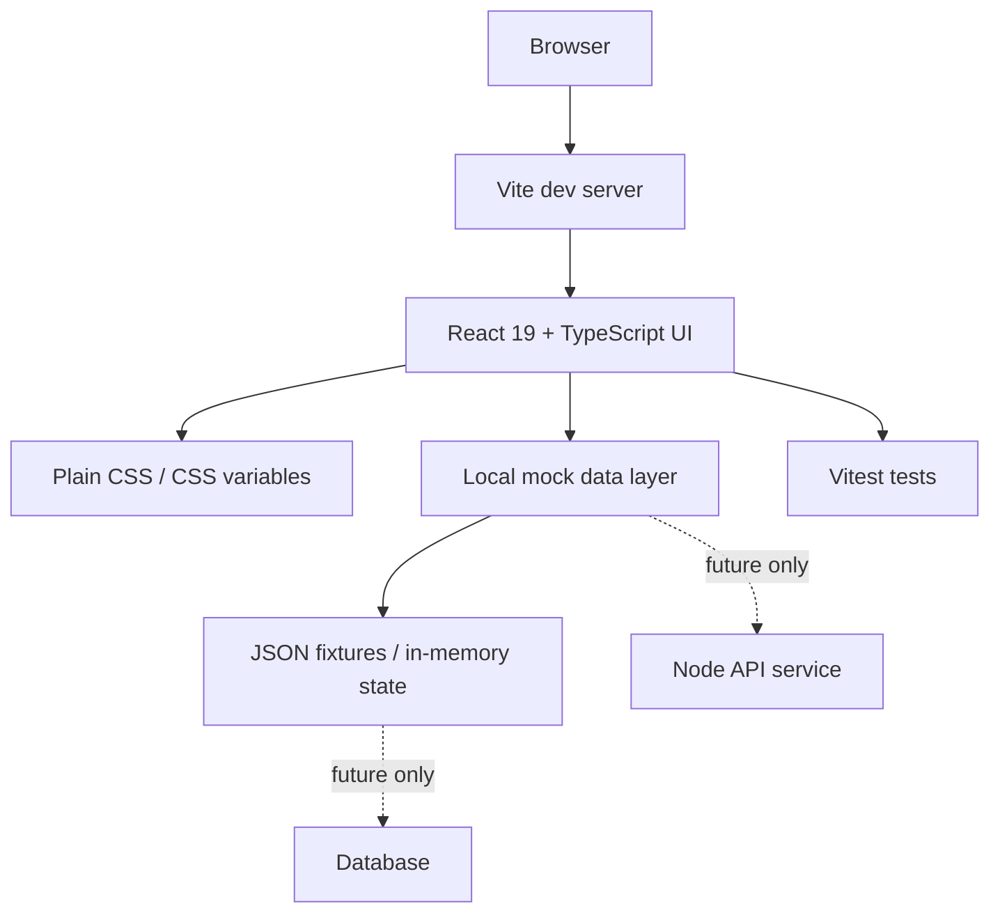

# ADR-0002: Tech Stack

## Status
Accepted

## Context

The project needs a stack that is:

- Fast to bootstrap
- Familiar to most frontend-oriented developers and agents
- Easy to run locally
- Good enough for a demo-sized LMS

The current repository already uses a Vite + React + TypeScript foundation.
The stack should align with that foundation rather than introduce unnecessary churn.

The team also needs an explicit answer for the common implementation questions:

- Is this plain HTML/JS? No.
- Is this a component-based frontend app? Yes.
- Does it use a UI library such as shadcn/ui? No for MVP.
- Does it use a real backend service in the first phase? Not as a separate service.
- Does it use a database in MVP? No.
- Does it use mock JSON or in-memory data? Yes.

## Decision

Use the following stack for the MVP and the first standard extension.

### Tech Stack Table

| Layer | Choice | Why | Not Used |
| --- | --- | --- | --- |
| Build tool / dev server | Vite | Fast local startup, simple config, already matches the repo foundation | Next.js, custom bundler |
| Frontend framework | React 19 | Component-based UI, reusable screens, good fit for an LMS | Plain HTML/JS |
| Language | TypeScript | Stronger contracts and fewer regressions between spec and code | JavaScript-only |
| Styling | Plain CSS + CSS variables | Small surface area, easy to control visually, no extra UI-library overhead | shadcn/ui, Tailwind, CSS-in-JS |
| UI state / data | Local mock layer in the same repo | Keeps MVP self-contained and reversible | Separate backend service |
| Seed data | JSON fixtures + in-memory state | Fast demo data, easy to reset | Database seed pipeline |
| Testing | Vitest | Fast feedback and close to the Vite ecosystem | Jest-only setup |
| Persistence | None for MVP | Demo speed matters more than storing data across restarts | Database |
| Backend | None as a separate service for MVP | Avoid unnecessary coordination and infra | Separate Node API service |

This means the MVP is a frontend-first app with local mock behavior, not a multi-service system.

## Why this stack

| Layer | Benefit |
| --- | --- |
| Vite | Fast startup and simple bundling |
| React | Standard choice for UI composition and demo work |
| TypeScript | Reduces contract drift between specs and code |
| Vitest | Keeps the test workflow close to the Vite ecosystem |
| Plain CSS | Keeps the styling stack simple and avoids unnecessary UI library weight |
| Mock/in-memory data | Keeps the MVP simple and reversible |

## Consequences

### Positive

- Fast local development
- Easy to reason about for both humans and agents
- Low friction for refactoring and testing
- Good fit for a small LMS with limited screens and flows
- Fewer dependencies and less visual-system overhead
- Easy to replace mock data with a real backend later if the product grows

### Negative

- No persistent data across restarts unless a persistence layer is added later
- No production-grade backend in the MVP
- No UI component library acceleration from shadcn/ui or similar tooling
- No server-rendered architecture in the MVP

## Rejected Alternatives

- Next.js
  - Rejected because the current project does not need SSR or app-router complexity
- shadcn/ui or another component library for MVP
  - Rejected because the app is small enough to style with plain CSS
- Separate backend framework immediately
  - Rejected because the MVP does not justify the coordination cost
- Database-first setup
  - Rejected because demo velocity is more important than persistence
- Plain HTML/JS without React
  - Rejected because the repo already uses a component-based frontend foundation and the product will benefit from reusable UI structure

## Implementation Guidance

- Keep contracts explicit in `/specs/api-contracts.md`
- If the stack changes, update this ADR before changing the codebase
- Add dependencies only when the current stack cannot express the requirement cleanly
- Keep mock data and styling simple until the product has a clear need to expand

## AI/Team Impact

The stack is common enough that agents can infer patterns quickly, and small enough that humans can review changes without deep setup knowledge.

## Related

- [ADR-0001: Architecture Style](./ADR-0001-architecture-style.md)
- [ADR-0003: Testing Strategy](./ADR-0003-testing-strategy.md)
- [ADR-0004: GitFlow and Branching Strategy](./ADR-0004-gitflow.md)
