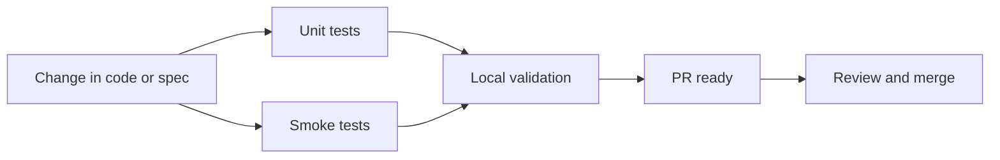

# ADR-0003: Testing Strategy

## Status
Accepted

## Context

The LMS project is small, but the most important flows are still easy to break during rapid iteration:

- Login
- Course listing
- Enrollment
- My courses

The team needs a test strategy that provides confidence without creating unnecessary overhead.

## Decision

Use a minimal but meaningful test stack:

- Unit tests for core helpers and state transitions
- A small number of smoke-style tests for the most important user flows
- Local test execution before changes are considered ready

Prefer tests that validate user-visible behavior and domain rules over large amounts of snapshot-heavy UI coverage.

## Scope of Tests

### Should be covered

- Login validation
- Duplicate enrollment prevention
- Enrollment state rendering
- Empty state for my courses
- Core API or state helpers if the app uses them

### Should not be overinvested in for MVP

- Exhaustive edge-case coverage
- Large end-to-end suites
- Snapshot tests for every component

## Consequences

### Positive

- Fast feedback for the highest-risk flows
- Keeps the repo lightweight
- Easier to maintain during rapid demo-driven development

### Negative

- Some edge cases may remain untested in the MVP
- Additional coverage may be needed later if the product expands

## Rejected Alternatives

- No tests
  - Rejected because it makes the demo fragile
- Full E2E-first strategy
  - Rejected because it adds overhead that is not justified by MVP scope
- Snapshot-heavy UI testing
  - Rejected because it tends to be brittle for a small evolving UI

## Implementation Guidance

- Test the business rule, not just the DOM
- Keep tests close to the behavior they protect
- When behavior changes, update the spec and the tests together

## AI/Team Impact

This strategy gives agents a clear validation target and keeps the review loop short.

## Related

- [ADR-0001: Architecture Style](./ADR-0001-architecture-style.md)
- [ADR-0002: Tech Stack](./ADR-0002-tech-stack.md)
- [ADR-0004: GitFlow and Branching Strategy](./ADR-0004-gitflow.md)
