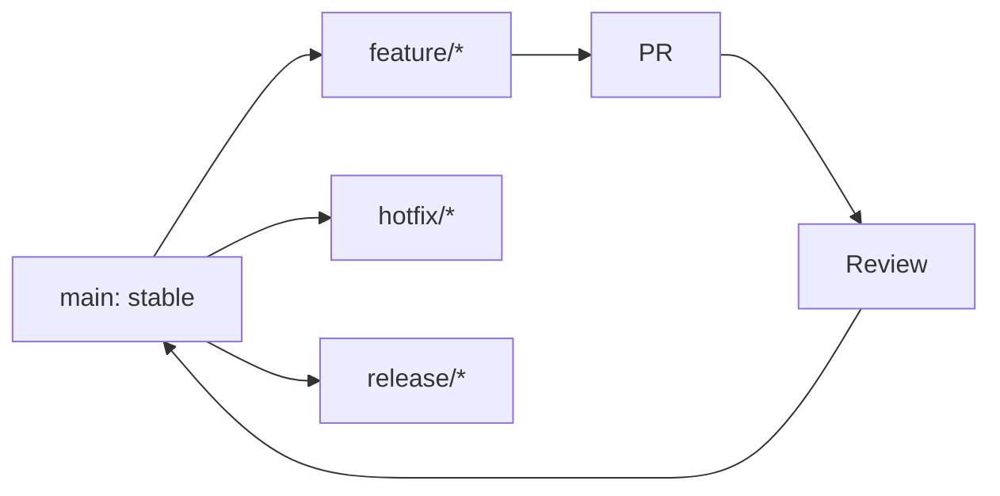

# ADR-0004: GitFlow and Branching Strategy

## Status
Accepted

## Context

The repository is shared by humans and agents.
The workflow must keep `main` stable while still allowing parallel task execution.

The workflow shown in the team diagrams is:

- `main` stays stable and deployable
- `feature/*` branches are used for task work
- `hotfix/*` branches are used for urgent fixes
- `release/*` branches may be used when a release needs stabilization

The team also needs a repeatable sequence for daily work:

1. Pull the latest changes
2. Pick one task
3. Create a feature branch
4. Implement in small commits
5. Run local validation
6. Open a PR
7. Review and merge
8. Repeat until the sprint is done

## Decision

Adopt a lightweight GitFlow-style workflow with the following rules:

- `main` is always stable and should remain deployable
- Every task should start on its own `feature/<task-id>-short-name` branch
- Urgent production fixes may use `hotfix/<issue-name>`
- Release stabilization may use `release/<version>`
- Changes should land via PR rather than direct commits to `main`
- Commit messages should stay task-oriented and readable
- Merge only after the task meets Definition of Done



## Branch Rules

### `main`

- Stable
- Deployable
- Protected by review and validation

### `feature/*`

- One task per branch
- Used for normal implementation work
- Merged back through PR

### `hotfix/*`

- Used only for urgent fixes on stable code
- Should be short-lived

### `release/*`

- Used only when a release needs stabilization or final verification
- Should be short-lived and focused

## Commit Rules

- Use small, meaningful commits
- Prefer a single task-oriented commit message format
- Keep commits easy to review and revert

Recommended format:

```txt
<TASK-ID>: <short description>
```

## PR Rules

- Every implementation branch should go through a PR
- PRs should include validation evidence
- PRs should be reviewed before merge
- Do not merge incomplete work into `main`

## Consequences

### Positive

- `main` stays trustworthy
- Branch purpose is easy to understand
- Parallel work becomes safer
- Agents have a predictable workflow to follow

### Negative

- Adds a small amount of process overhead
- Requires discipline around branch hygiene and PR review

## Rejected Alternatives

- Direct commits to `main`
  - Rejected because it makes the stable branch unreliable
- Free-form branching with no naming convention
  - Rejected because it reduces clarity for humans and agents
- Full enterprise GitFlow with heavy release branching
  - Rejected because the project is small and does not need that much overhead

## Implementation Guidance

- Pull the latest `main` before starting a branch
- Keep branches short-lived
- Avoid mixing unrelated tasks in one branch
- If a task becomes large, split it before implementation

## AI/Team Impact

This workflow matches the team diagrams and makes it easier for multiple contributors and agents to work in parallel without destabilizing `main`.

## Related

- [ADR-0001: Architecture Style](./ADR-0001-architecture-style.md)
- [ADR-0002: Tech Stack](./ADR-0002-tech-stack.md)
- [ADR-0003: Testing Strategy](./ADR-0003-testing-strategy.md)
